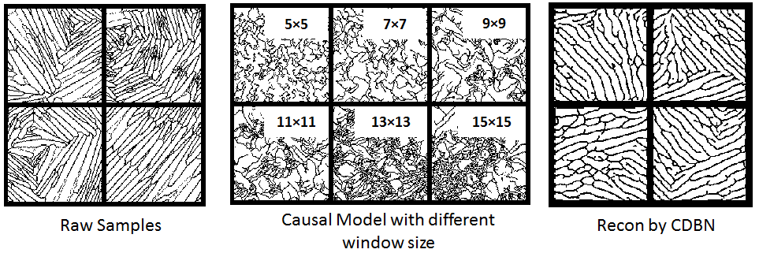

# Material-Design-Hybrid
# Scalable Microstructure Reconstruction with Multi-Scale Pattern Preservation
## Ruijin Cang, Aditya Vipradas, Max Yi Ren
Full paper here:
# Summary of the proposed Hybrid method:
We
- Set up a network with 3-layer CDBN(CRBM) + a causal method(markov random field).

- The network could gnereate generate 2D material microstructure images of arbitrary size that are visually similar to the authentic ones of a material system.

- The reconstructions by the proposed hybird method could also generate images are statistically similar to the authentics ones by evaluating their 2-point-correlation functions.

# Limitation of pure CDBN and pure causal method:

- As been described in the paper(Microstructure Representation and Reconstruction of Heterogeneous Materials via Deep Belief Network for Computational Material Design: [https://arxiv.org/abs/1612.07401](https://arxiv.org/abs/1612.07401))
the reconstructions generated by CDBN or other feature learning methods, are mostly of a fixed size, which limits their application to designing microstructures of arbitrary sizes.

- Pure causal method performs well on materials satisfies the markovian assumptions, but becomes very inefficient when the microstructures are complicated, 
such as Ti-6Al-4V as shown below(Left: authentic samples of Ti64; Middle: Reconstructions using a MRFmodel with six window sizes, marked in the images;
Right: Reconstructions via CDBN: Better visual quality than MRF but fixed size):

# Detail of the Hybrid Method

## Descriptions of causal method:
The model assumes that each pixel in a 2D image follows a stationaly MRF, i.e. a pixel value Y_ij is determined by the pixel values around it,
as shown in the image below, Y_ij's pixel value is decided by all the X_ij. So based on this assumption, a classification tree could be applied to learn such conditional distribtuion.
(please refer to the paper for the detail of the causal part).

## Descriptions of the CDBN part:
Different from the paper([https://arxiv.org/abs/1612.07401](https://arxiv.org/abs/1612.07401)), here only 3-layers of CDBN is applied and the
causal method is used on the highest activation layer. One thing to be noticed is that, for Ti64, Pb-Sn and Sandstone, we trained 3-layer CDBN,
for spherical colloids, only 1 layer CRBM is used; also the channels for the highest activation layer is also various, for Ti64 is 288 channels,
64 channels for Pb-Sn and Sandstone, 1 channel for Spherical Sandstone, due to the complexity of different microstructures(detail refer to the paper).

## Clustering
We noticed that the activations across channels in the CDBN ouput layer are correlated. And the same correlation occurs across images, as shown below.
However, the proposed random field model doesn't capture this correlation. To enable correlations, we propose to identify the clustering of channels based on their activation patterns from the training samples.

## Post-processing
Post-processing is needed to improve the quality of reconstructions for Ti64. The image shown below shows the activations of the CDBN ouput layer
above and their corresponding reconstructions below. One can see that directly applying the generated activation will lead to less deireable outcomes.

# Implementation Notice:

